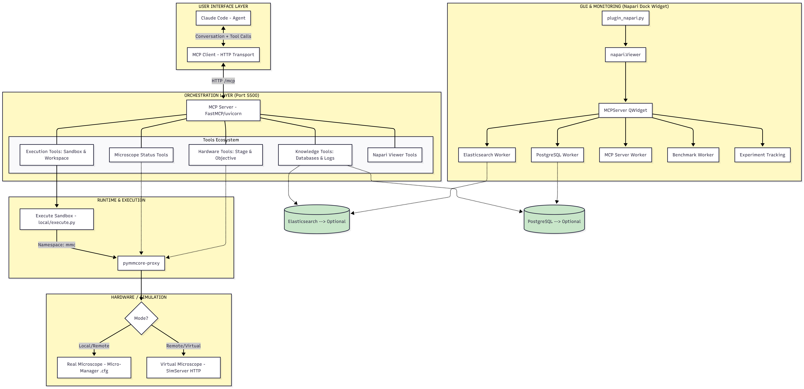

# Microscope Toolset
This repository is a toolset for microscope that use pymmcore-plus with LLM

---

> ⚠️ **Security & Liability Warning**
>
> This toolset gives an LLM agent direct access to your computer: it can execute arbitrary Python code, read and write files, control microscope hardware, and install packages into your Python environment.
>
> **You are responsible for reviewing every action the agent proposes before approving it.** In particular:
> - The `install_packages` tool will install packages directly into your active conda/uv environment. Only approve packages you recognise and trust.
> - The `execute_python_code` tool runs code with the same privileges as your user account.
>
> The author(s) of this project accept **no responsibility** for any damage, data loss, security incident, or unintended hardware interaction that may result from using this software. Use it at your own risk.

---

### How to get started

Clone the repository first:
```bash
git clone https://github.com/ddd42-star/microscope-toolset.git
cd microscope-toolset
```

Then set up a Python 3.12 environment using either **conda** or **uv**:

---

#### Option A — Conda (Anaconda / Miniconda / Mamba)

```bash
conda create -n microscope-toolset python=3.12.11
conda activate microscope-toolset
pip install -r requirements.txt
pip install -e .
```

---

#### Option B — uv

Install uv if you don't have it yet:
```bash
pip install uv
```

Create the environment:
```bash
uv venv --python 3.12
# Windows
.venv\Scripts\activate
# macOS / Linux
source .venv/bin/activate
```

**Install from `pyproject.toml` (recommended with uv):**
```bash
uv sync           # installs all dependencies defined in pyproject.toml
uv sync --extra dev  # also includes pytest, pre-commit, coverage, …
```

`uv sync` reads `[tool.uv.sources]` in `pyproject.toml` to resolve `virtual-microscope` and `pymmcore-proxy` from git automatically. If you have local clones of those packages in the project folder, switch the relevant lines in `[tool.uv.sources]` to path sources — see the comments in `pyproject.toml`.

**Alternative — install from `requirements.txt`** (same as the conda path):
```bash
uv pip install -r requirements.txt
uv pip install -e .
```

> **PyTorch + CUDA:** uv installs the CPU-only build of torch by default. To enable CUDA support, uncomment the `torch` index entry in `[tool.uv.sources]` inside `pyproject.toml` and set your CUDA version (`cu118`, `cu121`, `cu124`, …) before running `uv sync`.

---

#### Optional databases: Elasticsearch and PostgreSQL

Both Elasticsearch and PostgreSQL are **optional**. The toolset starts and runs without them — database-backed features (semantic search, session logging) are simply skipped when the services are not configured.

A full setup and usage guide for both databases is under implementation. For now, set the relevant variables in your `.env` file to enable them:

**Elasticsearch** — used for semantic search over API docs and publications:
```
ELASTICSEARCH="<path to your elasticsearch installation>"   # enables auto-start of the ES server
ELASTICSEARCH_URL="http://localhost:4500"                   # connection URL (default shown)
```

**PostgreSQL** — used for logging agent sessions:
```
DB_HOST="localhost"
DB_PORT=5432
DB_NAME="<your database name>"
DB_USER="<your user>"
DB_PASSWORD="<your password>"
```

If any of the `DB_*` variables are absent, the PostgreSQL logger is skipped automatically.

### Model configuration

The toolset uses two models, both configurable via the `.env` file:

**1. Claude (Anthropic) — for query reformulation inside the database agent**

Set your API key and choose a model:
```
ANTHROPIC_API_KEY="your-anthropic-api-key-here"
ANTHROPIC_MODEL="claude-haiku-4-5-20251001"
```

| Model | Speed | Quality | Cost |
|---|---|---|---|
| `claude-haiku-4-5-20251001` | Fast | Good — recommended for query reformulation | Low |
| `claude-sonnet-4-6` | Medium | Higher quality | Medium |
| `claude-opus-4-7` | Slow | Best quality | High |

**2. Sentence-transformers — for embedding queries into Elasticsearch KNN search**

```
EMBED_MODEL="BAAI/bge-small-en-v1.5"
```

| Model | Dimensions | Size | Quality |
|---|---|---|---|
| `all-MiniLM-L6-v2` | 384 | ~80 MB | Fast / lightweight |
| `BAAI/bge-small-en-v1.5` | 512 | ~120 MB | Good — default |
| `all-mpnet-base-v2` | 768 | ~420 MB | Better |
| `BAAI/bge-base-en-v1.5` | 768 | ~420 MB | Better |
| `BAAI/bge-large-en-v1.5` | 1024 | ~1.2 GB | Best local quality |

> **Important:** the embedding dimension must match your Elasticsearch KNN index. If you change `EMBED_MODEL` you must re-index all your Elasticsearch data.

The model is downloaded automatically on first run.

### How to start the toolset

Run the following command for starting the Napari GUI
```
python -m src.plugin_napari
```
On the right there is the panel control that will start or stop the MCP Microscope Toolset server.

```
Add the mcp server to you claude code account

$ claude code add --transport http microscope http://127.0.0.1:5500/mcp

Then goes in /mcp

$ /mcp + enter

And select the microscope MCP server either connecting the server or enabling the server, and from the terminal whery you started the napari-plugin you will see if the server correctly connected.
```
After you added the *mcp.json* configuration file, you can start the MCP Client that will connect to the server.

### Project structure




### Execution guardrails

The `execute_python_code` tool runs agent-submitted Python code through a series of safety and correctness checks before execution:

**General checks (all code):**
- Blocks re-instantiation of `CMMCorePlus` / `UniMMCore` — the pre-configured `mmc` instance must be used
- Blocks `.loadSystemConfiguration()` / `.loadConfig()` — hardware configuration is managed by the toolset
- Blocks any reference to `viewer` or `napari.current_viewer()` — GUI access must go through the dedicated `viewer_*` tools
- Auto-detects missing packages before execution and surfaces them for user approval

**Library-specific guardrails (cellpose):**

When `cellpose` is imported the following checks are enforced:

| Check | What it blocks | Why |
|---|---|---|
| `diameter` required | Calls without an explicit diameter kwarg | Cellpose defaults to 30 px — wrong for most microscopy samples |
| `channels` required | Calls without explicit channel assignment | Default `[0,0]` fails silently on multichannel fluorescence images |
| `flow_threshold` range | Literal values outside `[0.0, 3.0]` | Values > 1.0 accept noise as cells; < 0.0 misses real cells |
| `cellprob_threshold` range | Literal values outside `[-6.0, 6.0]` | Extreme values cause silent over/under-segmentation |
| Image size (runtime) | Images larger than 512×512 px | Large images make segmentation very slow |

If an image exceeds 512×512, the agent receives an error with a ready-to-use resize + mask rescale snippet (using `cv2.INTER_NEAREST` to avoid blending label IDs). To opt out and use the original image size, set `cellpose_allow_large_image = True` in the code before the `eval` call.

**Adding guardrails for other libraries:**

The guardrail system is extensible. Static (AST-based) guards and runtime (monkey-patch) guards can be registered for any library from any module:

```python
Execute.register_library_guard("mylib", my_ast_guard_fn)   # runs before exec
Execute.register_runtime_guard("mylib", my_installer_fn)   # runs during exec
```

If you need a guardrail for a library that is not yet covered, please [open an issue or submit a PR](https://github.com/ddd42-star/microscope-toolset/issues).

### Testing

Run the full test suite with:

```bash
python -m pytest test/ -v
```

Most tests run without any additional setup. The table below lists every test module and what it covers:

| Module | What it tests | Needs real HW? |
|---|---|---|
| `test_classify_cfg.py` | `classify_cfg` — detects virtual / real / mixed cfg files | No |
| `test_execute.py` | Python code safety guards, import validation, cellpose guardrails | No |
| `test_core_proxy_worker.py` | `CoreProxyWorker` signal wiring, mixed-cfg rejection, full proxy start with DemoCamera | No |
| `test_all_signals.py` | Full signal coverage of `RemoteMMCore` against a virtual microscope | Opt-in (see below) |
| `test_init.py` | Basic package import smoke tests | No |

#### Opt-in: virtual microscope tests

Two tests spin up a real virtual microscope backend and are **skipped by default** to keep the standard run fast:

- `test_core_proxy_worker.py::test_full_server_start_virtual` — starts a proxy against `bacteria.cfg` (virtual)
- All tests in `test_all_signals.py` — full signal coverage using `particle.cfg` (virtual)

To enable them, set `VIRTUAL_MICROSCOPE_TESTS=1`:

```bash
# Windows
$env:VIRTUAL_MICROSCOPE_TESTS = "1"
python -m pytest test/ -v

# macOS / Linux
VIRTUAL_MICROSCOPE_TESTS=1 pytest test/ -v
```

These tests also require the `virtual-microscope` package to be installed. If you used `uv sync` it is included automatically (resolved from the git source in `[tool.uv.sources]`). If you are on a conda environment, install it manually:

```bash
pip install git+https://github.com/hinderling/virtual-microscope
```

The virtual-microscope tests also expect the `bacteria.cfg` and `particle.cfg` configuration files to be present under `virtual-microscope/src/virtual_microscope/backends/`. These are included in the cloned repository so no extra step is needed if the git source was used.

---

### Benchmarking

The toolset includes a simulation-based benchmarking system for evaluating agent performance using the knowledge database from the *self-learn-loop*. Each benchmark test is a self-contained virtual microscope scenario served to the agent over HTTP — the agent cannot see the ground truth or simulation configuration.

Tests are launched from the **Benchmarking** panel in the MCPServer GUI, or from the CLI:

```bash
# Start a test server on port 5602
python -m src.benchmarking.test_server test_1 --port 5602

# List all available tests
python -m src.benchmarking.test_runner
```

To add a new test, see [Benchmark Tests](docs/benchmark_test_authoring.md).

---

### Experiment Tracking

Experiment Tracking records a complete snapshot of a Claude Code agent session — every user turn, tool call, and result — so you can replay or review what happened after the experiment ends.

#### What gets recorded

When you click **Start Tracking** in the GUI (or call `start_experiment()` programmatically), the toolset notes the current line position in the active Claude Code session file. When you click **Stop**, it extracts everything added since that point and saves it to a timestamped folder.

Each saved experiment folder contains:

```
src/benchmarking/experiments/<name>_<timestamp>/
│
├── conversation.jsonl          # All Claude Code turns captured during the experiment
│                               # (user messages, agent responses, tool calls + results)
│
├── workspace/                  # Folder pre-created for the agent to save outputs:
│                               # images, CSV files, analysis results, figures, etc.
│
└── session_data/               # Copy of the Claude Code session subdirectory
    ├── tool-results/<id>.txt   # Large tool outputs offloaded from the JSONL
    ├── subagents/<id>.jsonl    # Full conversation of each spawned subagent
    └── subagents/<id>.meta.json # Subagent type and description metadata
```

#### How to start and stop tracking

**From the GUI** — use the **Experiment Tracking** panel in the control widget. Enter a name and click **Start Tracking**; click **Stop** when the experiment is done. The **Open** button opens the saved folder in the file explorer.

**From the CLI** (useful when running without a GUI or during benchmarking):

```bash
# Start (creates the experiment folder immediately)
python -m src.benchmarking.experiment_saver start "my_experiment"

# Stop and save the conversation slice
python -m src.benchmarking.experiment_saver end

# List all saved experiments
python -m src.benchmarking.experiment_saver list

# Check whether an experiment is currently active
python -m src.benchmarking.experiment_saver status
```

#### Reviewing a saved experiment

Pass the path to a saved `conversation.jsonl` to the napari launcher to open the interactive dashboard:

```bash
python -m src.plugin_napari --review src/benchmarking/experiments/<name>/conversation.jsonl
```

The dashboard shows a full timeline of the session: user messages, agent reasoning, every tool call with its inputs and outputs, hardware events from the microscope log, subagent conversations, estimated token cost, and duration.

You can optionally merge in the pymmcore-plus hardware log for a combined view of software and hardware events:

```bash
python -m src.plugin_napari --review <path_to_conversation.jsonl> --log <path_to_pymmcore-plus.log>
```

---

### TO DO LIST

- [x] Fix use of Elasticsearch and PostgresSQL database
- [x] Add summary of Claude Code Agent session
- [ ] Calculate some Analysis insight as: nb tokens, duration, final code, whole conversation between user and agent. Was planning to do it on a jupyter notebook but if a better way exists then lets implement it
- [x] Add the possibility to use a remote core. This will replace the part of executing it on the mcp tool execution code, but for other image analysis, will need to stay.
- [ ] Plan the experiments to do on the real microscope to show the train & untrained Agent.
- [ ] Plan to create additional metadata from the microscope session
- [x] Build a chatbox for visualising user-agent conversation, including time, tool calls, ect.
- [ ] Switch local virtual simulation to virtual simulation from the package virtual_microscope
- [ ] Add `console_scripts` entry point so the toolset can be launched with `microscope-toolset` instead of `python -m src.plugin_napari` (add `[project.scripts]` to `pyproject.toml` and wrap startup in a `main()` function)
- [ ] Switch off mcp tool to run python tool and instead use local env from claude
- [ ] Introduce Claude Sandbox or Sandobx

